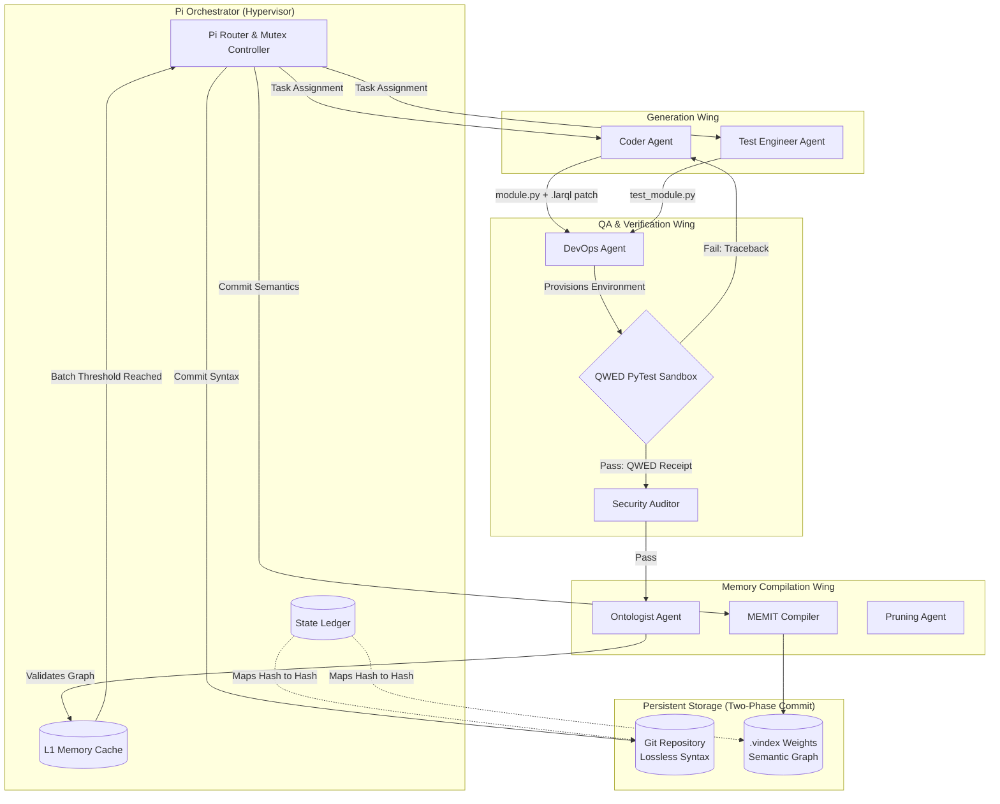

# Comprehensive Engineering Specification: Pi Agent Harness & "LLM-as-a-Database"

**Version:** 2.0 (Granular Engineering Spec)
**Document Purpose:** To serve as the definitive contextual master-document for instantiating, developing, and scaling the Pi Agent Harness. This document provides exact subsystem workflows, agent contracts, memory paradigms, and architectural diagrams suitable for ingestion by Claude 3.5 Sonnet, GPT-4o, Gemini 1.5 Pro, and specialized coding models.

---

## 1. The Core Paradigm: Parametric vs. In-Context Memory

Traditional agent frameworks (e.g., AutoGen, CrewAI) rely on **Retrieval-Augmented Generation (RAG)**. They use vector databases to retrieve text and inject it into the LLM's context window. 
* **The Flaw:** This suffers from "Lost in the Middle" degradation, extreme token latency, and context-window exhaustion. 

The Pi Harness introduces **In-Weight Learning** (Parametric Memory). 
* **The Concept:** Treat the Feed-Forward Network (FFN) of a frozen base model (like Llama 3 or Gemma) as a physical graph database. Project-specific architecture, API schemas, and entity relationships are compiled directly into the neural weights via direct model editing.
* **The Hybrid Anchor:** Because neural networks are probabilistic, they suffer from "token drift" if forced to memorize literal code syntax. Therefore, Pi uses a **Two-Phase Commit**: exact syntax strings are stored losslessly in **Git**, while semantic architectures are stored in the **LLM Weights**.

---

## 2. Global Architecture (Mermaid Diagram)



---

## 3. Foundational Frameworks & Literature Sources

The system is built upon the following peer-reviewed frameworks and algorithms:

### 3.1. MEMIT (Mass-Editing Memory in a Transformer)
* **Source:** Meng et al., 2023 ("Mass-Editing Memory in a Transformer")
* **Role:** The "database compiler." MEMIT allows for the simultaneous injection of up to 10,000 factual associations into an LLM's weights.
* **Implementation:** Pi targets the "knowledge layers" (typically layers 15-25). MEMIT utilizes a covariance adjustment factor (`lambda`) to ensure that newly injected project architectures (e.g., "Use React 19") are mathematically orthogonal to the model's base knowledge (e.g., General JavaScript syntax), preventing catastrophic forgetting.

### 3.2. QWED Protocol (Deterministic Verification)
* **Source:** QWED-AI/qwed-verification (GitHub)
* **Role:** The "Untrusted Translator" safeguard. QWED enforces that the LLM is never allowed to grade its own homework. It utilizes exact mathematical engines (SymPy, Z3 solvers, PyTest, AST) in isolated sandboxes to generate cryptographic ES256 signatures proving that the code executes flawlessly *before* it is committed to memory.

### 3.3. Multi-Agent Reflexion (MAR)
* **Source:** Shinn et al. (Reflexion) & Ozer et al. (MAR)
* **Role:** The failure-recovery loop. When the QWED Sandbox throws an error, the traceback is passed back to the Coder Agent. MAR proves that separating the "Coder" from the "Test Engineer" prevents the agent from rewriting the test to pass flawed code (Confirmation Bias).

### 3.4. Activation Steering / Representation Engineering (RepE)
* **Source:** Turner et al., 2023 & Sewak, 2025
* **Role:** Tier-2 Transient Memory. Not all context should be permanent. For ephemeral needs (e.g., "Adopt a strict security persona for this task"), Pi injects steering vectors directly into the residual stream at inference time, altering behavior without touching the `.vindex`.

---

## 4. Agent Roster & Interaction Contracts

Agents in Pi are defined as single-file configurations (`.yaml`) containing precise system prompts, tool access definitions, and I/O contracts.

### A. Architect Agent (Project Genesis)
* **Trigger:** Initialization of a new repository.
* **Input:** Raw Product Requirements Document (PRD) / User intent.
* **Logic:** Translates requirements into binary constraints. Executes `.larql` read queries against the base model to shortlist frameworks. Directs the DevOps agent to run a deterministic "micro-bake-off" between candidate stacks.
* **Output:** Foundation `.larql` patch establishing the base `.vindex` for the project.

### B. Coder Agent
* **Constraint:** Blind to the test cases. 
* **Input:** Task prompt + Zero-latency intuition from the active `.vindex`.
* **Output:** Dual Payload -> 1. Raw code (`module.py`), 2. Proposed Semantic Graph update (`patch.larql`).

### C. Test Engineer Agent
* **Constraint:** Blind to the Coder's implementation.
* **Input:** Task prompt + `.vindex` architecture rules.
* **Output:** Pure unit/integration test logic (`test_module.py`).

### D. DevOps Agent
* **Trigger:** Receives payloads from Coder and Tester.
* **Logic:** Parses `package.json` or `requirements.txt`. Dynamically provisions the QWED Docker/E2B sandbox (e.g., spinning up sidecar Redis or Postgres containers).
* **Output:** A ready-to-execute test environment.

### E. Validator Agent
* **Logic:** Executes the test suite in the DevOps-provisioned sandbox.
* **Output:** If pass -> Cryptographic QWED receipt. If fail -> Strict stdout/stderr traceback routed back to the Coder.

### F. Ontologist Agent
* **Logic:** The Semantic Reviewer. Reads the passing `module.py` and the Coder's proposed `patch.larql`. Ensures the code is cleanly decoupled and perfectly maps to the Knowledge Triples format. Rejects spaghetti code.
* **Output:** Verified `.larql` patch routed to the L1 Cache.

### G. Pruning Agent (The Neural Janitor)
* **Trigger:** Background Cron-Job (e.g., every 50 Git commits).
* **Logic:** Diffs the Git file tree against the `.vindex` graph. Detects orphaned edges (deleted files/functions).
* **Output:** Generates `DELETE FROM EDGES` `.larql` patches to un-wire dead neural connections and prevent hallucinations.

### H. Librarian Agent
* **Role:** Repository I/O Manager.
* **Logic:** Uses **Tree-sitter** (Abstract Syntax Tree parsing). When an agent needs to read `app.ts`, the Librarian does not dump 10,000 lines into the context window. It queries the AST and returns only the required function signatures and requested code blocks.

---

## 5. The `.larql` Language Specification

`larql` (Larco Query Language) is the SQL-like DSL used by agents to define the neural graph patches. 

**Example Payload generated by the Ontologist:**
```sql
-- Pi Harness: Cognitive State Patch
-- Target_File: src/auth.py
BEGIN TRANSACTION;

-- 1. DEFINE ENTITIES (Nodes)
INSERT INTO ENTITIES (entity_id, entity_type, semantic_description)
VALUES
  ('module:auth', 'file', 'Handles JWT verification'),
  ('func:verify_jwt', 'function', 'Validates signatures'),
  ('model:User', 'database_schema', 'SQLAlchemy User object');

-- 2. MAP TOPOLOGY (Edges & Covariance Weights)
-- 'attention_weight' guides the MEMIT algorithm's projection force.
INSERT INTO EDGES (source_id, relation, target_id, attention_weight)
VALUES
  ('module:auth', 'exports', 'func:verify_jwt', 1.0),
  ('func:verify_jwt', 'queries', 'model:User', 0.85);

-- 3. MEMIT COMPILER DIRECTIVES
SET TARGET_LAYERS = [15, 25];       -- Target FFN knowledge layers
SET ORTHOGONAL_PROJECTION = TRUE;   -- Prevent catastrophic forgetting

COMMIT;
```

---

## 6. Production Safeguards & State Management

To prevent the autonomous factory from collapsing into chaotic race conditions, Pi implements a strict **State Synchronization Plane**.

### 6.1. L1 Memory Cache
* **Problem:** Running MEMIT for every single line of code changed will bottleneck the GPU.
* **Solution:** Verified `.larql` patches are placed in an L1 JSON Buffer. The agents read from the `.vindex` AND the L1 Cache. Pi only executes the heavy MEMIT compile to the `.vindex` when the L1 cache hits 50 patches, or upon a Git `main` merge.

### 6.2. Sub-Graph Mutex Locking
* **Problem:** Agent A and Agent B attempt to modify the `auth.py` neural pathways simultaneously, causing MEMIT interference.
* **Solution:** Before generating code, agents must submit a `LOCK REQUEST` for specific entity IDs. Pi grants an exclusive write-lock on that subgraph until the QWED transaction is complete.

### 6.3. The Temporal State Ledger
* **Problem:** If a user runs `git checkout v1.2` to look at old code, the LLM's `.vindex` memory is now from the future, causing massive hallucination.
* **Solution:** Pi maintains a SQLite Ledger mapping `Git Commit Hash <--> .vindex Snapshot Hash`. 
    * *Hook:* Upon detecting a git checkout, Pi instantly unmounts the active `.vindex` from the base model and hot-swaps the exact `.vindex` that existed at that point in time. 

---

## 7. Quarantined Dependencies: Pixeltable

While the core Pi Harness is strictly a `Git + MEMIT` architecture, external data must be formatted perfectly before Pi can ingest it.

* **Role of Pixeltable:** Confined strictly to the **ETL Staging Ground** during the "Project Genesis" phase.
* **Function:** If building a Local SEO workflow, raw PDFs, scraped HTML, and competitor images are dumped into Pixeltable. Pixeltable's deterministic computed columns parse this unstructured data into clean "Knowledge Triples" (Entity -> Relation -> Target). Pi then ingests these triples to compile the initial `.vindex`. 
* **Rule:** Pixeltable is NEVER used as an agent memory retrieval tool during the active CI/CD loop.

---

## 8. Development Implementation Plan (Next Steps)

To begin building this system, the LLM ingesting this document should prioritize generating PRDs and code for the following modules in order:
1. **The Sub-Graph Mutex & L1 Cache Controller** (Python, core Pi loop).
2. **The QWED Sandbox Integrator** (Docker/E2B container management).
3. **The `.larql` to MEMIT translation layer** (Parsing the SQL DSL into HuggingFace tensor targets).
4. **The Tree-sitter Librarian Agent** (AST context management).